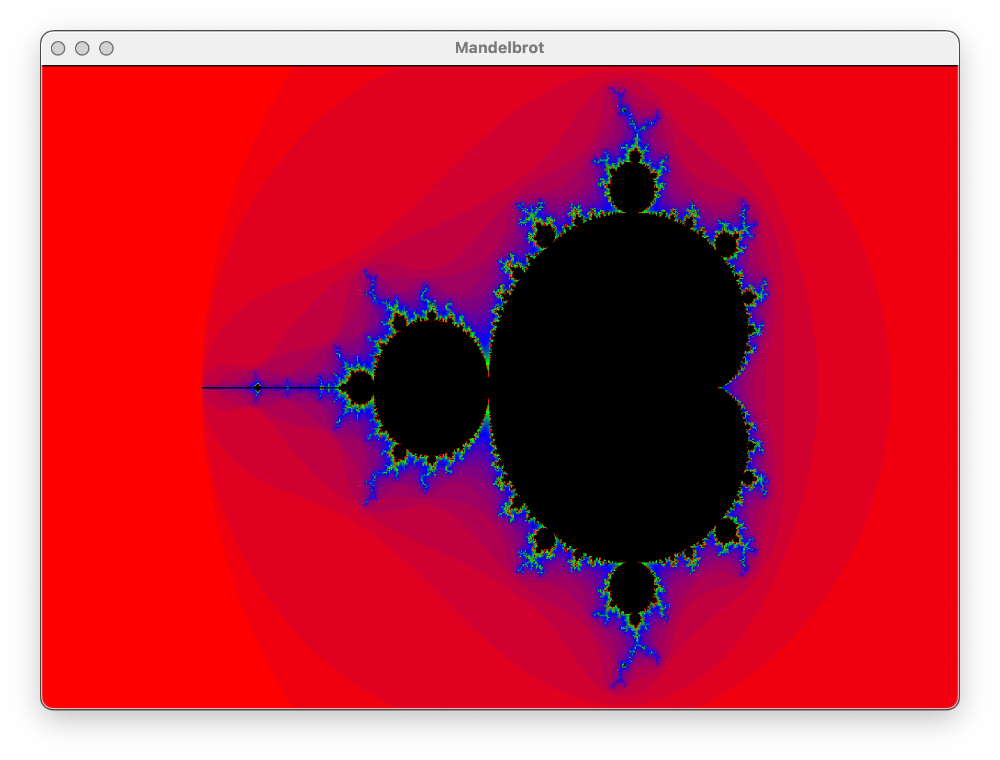
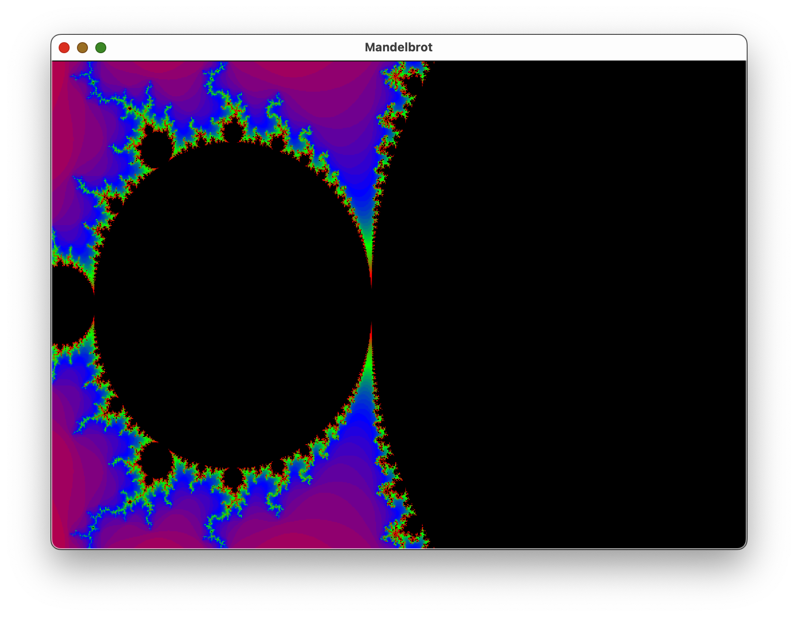

# MandelbrotSet
Mandelbrot Explorer implemented in C++ using SFML.

## Setup
Make sure sfml is installed:

    brew install sfml

## Run Program
From MandelbrotSet/MandelbrotSet, run:

    g++ -Wall -std=c++11 main.cpp -Iinclude -I/opt/homebrew/include -L/opt/homebrew/lib -lsfml-audio -lsfml-graphics -lsfml-window -lsfml-system -o game

Then:

    ./game

Use ASDW and + and - to move around and zoom in and out.

